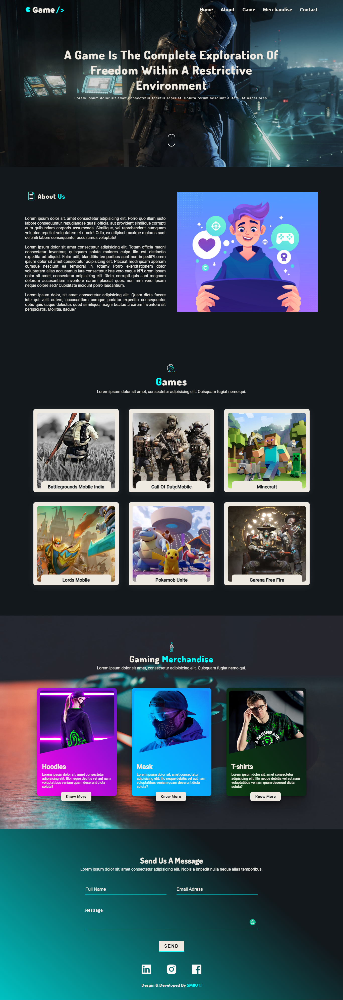
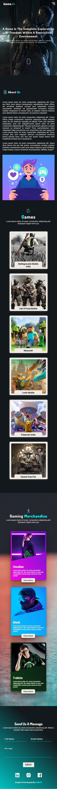

# Gamewebsite
This is gaming website template and fully responsive ( HTML , CSS And JavaScript)

#### Demo Live Now : [GO](https://sm8uti.github.io/gamewebsite/)

## Pc Version

 

##Mobile Version

<!DOCTYPE html>
<html lang="ar">
<head>
  <meta charset="UTF-8">
  <meta name="viewport" content="width=device-width, initial-scale=1">
  <title>موقع تحميل الألعاب</title>
  <link rel="stylesheet" href="style.css">
</head>
<body>
  <header>
    <h1>ألعاب مجانية</h1>
  </header>

  <main>
    

      
      <h2>Free Fire</h2>
      <a href="downloads/freefire.apk" download>تحميل اللعبة</a>
    

    

      
      <h2>Subway Surfers</h2>
      <a href="downloads/subway.apk" download>تحميل اللعبة</a>
    

    <!-- أضف المزيد من الألعاب هنا -->
  </main>

  <footer>
    
جميع الحقوق محفوظة © 2025

  </footer>
</body>
</html>
body {
  font-family: Arial, sans-serif;
  direction: rtl;
  background-color: #f4f4f4;
  text-align: center;
  margin: 0;
  padding: 0;
}

header {
  background-color: #333;
  color: white;
  padding: 20px;
}

main {
  display: flex;
  flex-wrap: wrap;
  justify-content: center;
  gap: 20px;
  padding: 20px;
}

.game-card {
  background-color: white;
  border-radius: 10px;
  box-shadow: 0 0 10px #ccc;
  padding: 10px;
  width: 200px;
}

.game-card img {
  width: 100%;
  border-radius: 10px;
}

.game-card a {
  display: block;
  margin-top: 10px;
  background-color: #28a745;
  color: white;
  text-decoration: none;
  padding: 10px;
  border-radius: 5px;
}

footer {
  background-color: #333;
  color: white;
  padding: 10px;
}
